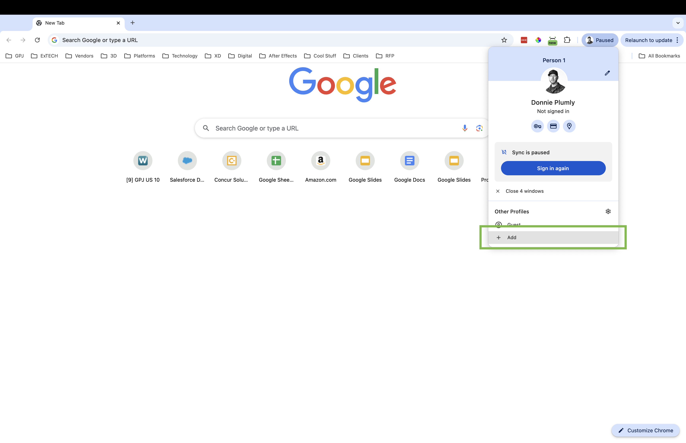
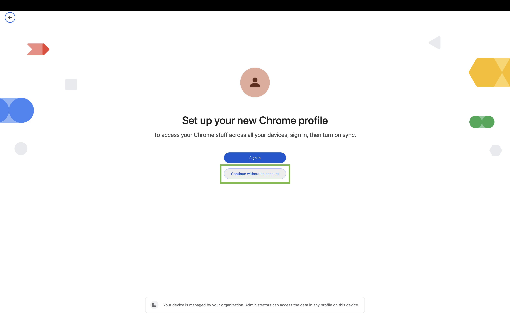
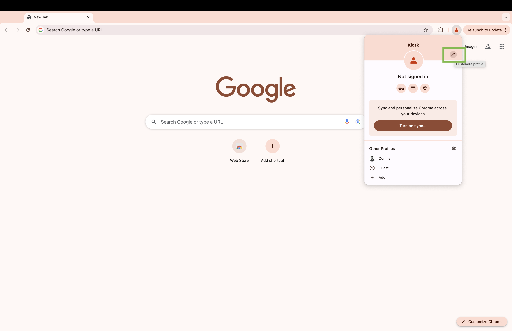
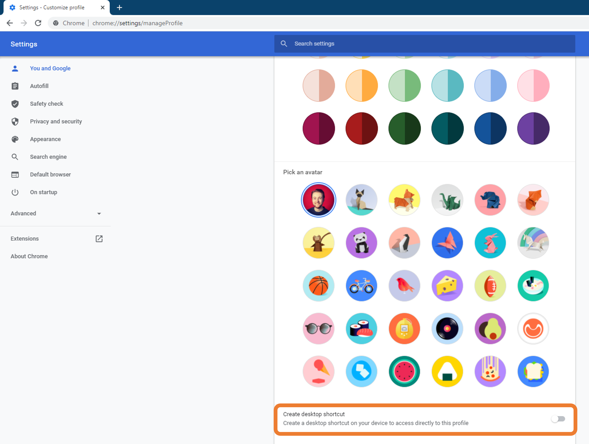
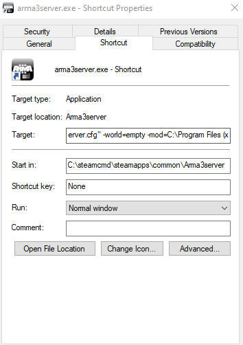

# Timeout Function

Always have a timeout function. Typically, 60 secs to trigger and 10 secs to reset. Here is a [Figma](https://www.figma.com/design/d4PdgcZelUQyn27mfgHHEm/Simple-slider-timeout-design?node-id=0-1&t=rllvg4vUTs6zNBJg-1)
 

# Hidden Reset Button
Make sure we create a hidden reset button. Typically this is in the upper left hand corner. I can be placed in other areas if needed based on the experieinces UI. 
 

# Auto Hide Mouse 
Install this app.
 

# QR Code Scanner Override
If your experience uses a Barcode/QR code scanner make sure to have an override for testing. Not everyone will have one at their house and they need to be able to test the experience.
 

# Analytics
Capture analytics. Make sure your timeout ends the session if the experience resets.
 

# Salesforce Activation Layer
Best practices for utilizing.

- proper request timeout
- proper error handling
- Any place that uses data from the activation layer, i.e. "Hello Bob," make sure there's placeholder alt for the copy
- Queue system and ability to run a function to have it re-fetch all missing data.

# Kiosk Mode Guide

Set all your touchscreen web apps in Kiosk Mode in Chrome.

Kiosk mode

Follow these steps.
https://support.facilitynet.dk/hc/da/articles/360052966691-How-to-setup-Chrome-Kiosk-Mode-in-Windows-10

1. Make chrome profile. Click the profile picture then, click add.

 

2. Continue without an account.

 

3. Name your profile what you would like. 

 

4. Click the customize profile (The pencil icon).

 

5. Create a Desktop icon by clicking the switch.

 

6. In the Target add the items below after the current exe path.
 

Add --kiosk “http://ur.com” --disable-context-menu --disable-pinch --disable-features=UseEcoQoSForBackgroundProcess

After added, close and open the browser. If you have an instance open it will not accept the settings. At times, I do it a few times and it accepts the changes.

